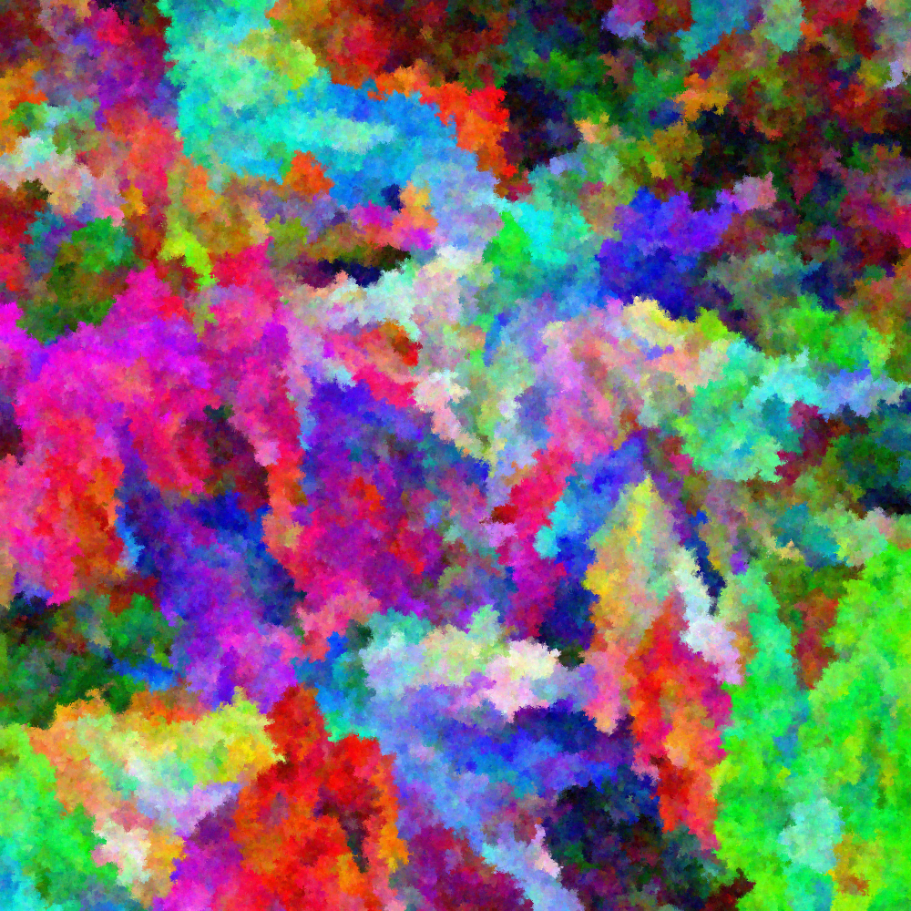

# water-me

Computer-generated art in the style of watercolors. Points are seeded.
Colors initially diffuse wildly, then more gently as distance from seed increases.
Mixture of DFS and Random selection of pixels to fill in.
Small amount of fuzzing to smooth edges and fill in gaps.

